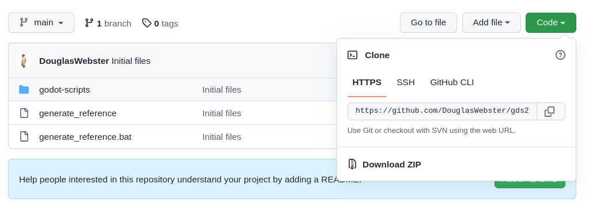

Script files
============

In order to create the reStructuredText files the following files need to be installed on your system.

For extracting information from Godot
-------------------------------------

- **Collector.gd**: Scans your Godot script files and extracts the required information
- **ReferenceCollector.gd**:     A setup file for determining what Collector.gd scans.
- **ReferenceCollectorCLI.gd**:  A command line tool for doing the same as ReferenceCollector.gd

For creating the .rst files
---------------------------

- **generate_reference**: Linux/macOS script for generating the reStructuredText text files.
- **generate_reference.bat**: Windows batch file for generating the reStructuredText text files.

Downloading the files
---------------------

The github repository `gds2rst_scripts <https://github.com/DouglasWebster/gds2rst_scripts>`_ has the
relevant files.

With git
^^^^^^^^

If you have git on your system the command

.. code:: console

    git clone https://github.com/DouglasWebster/gds2rst_scripts.git

will transfer the files to your current working directory.

Without git
^^^^^^^^^^^

If you don't have git on your system then go to the 
`gds2rst_scripts <https://github.com/DouglasWebster/gds2rst_scripts>`_ repository and look for the green Code
button, click it and click Download ZIP.

This will download a zip file containing the contents of the github repository.  These can then be unzipped
to your desired location.

In either case you should then have the following files in your project location

.. code:: console

    .
    ├── generate_reference
    ├── generate_reference.bat
    └── godot-scripts
        ├── Collector.gd
        ├── ReferenceCollectorCLI.gd
        └── ReferenceCollector.gd
