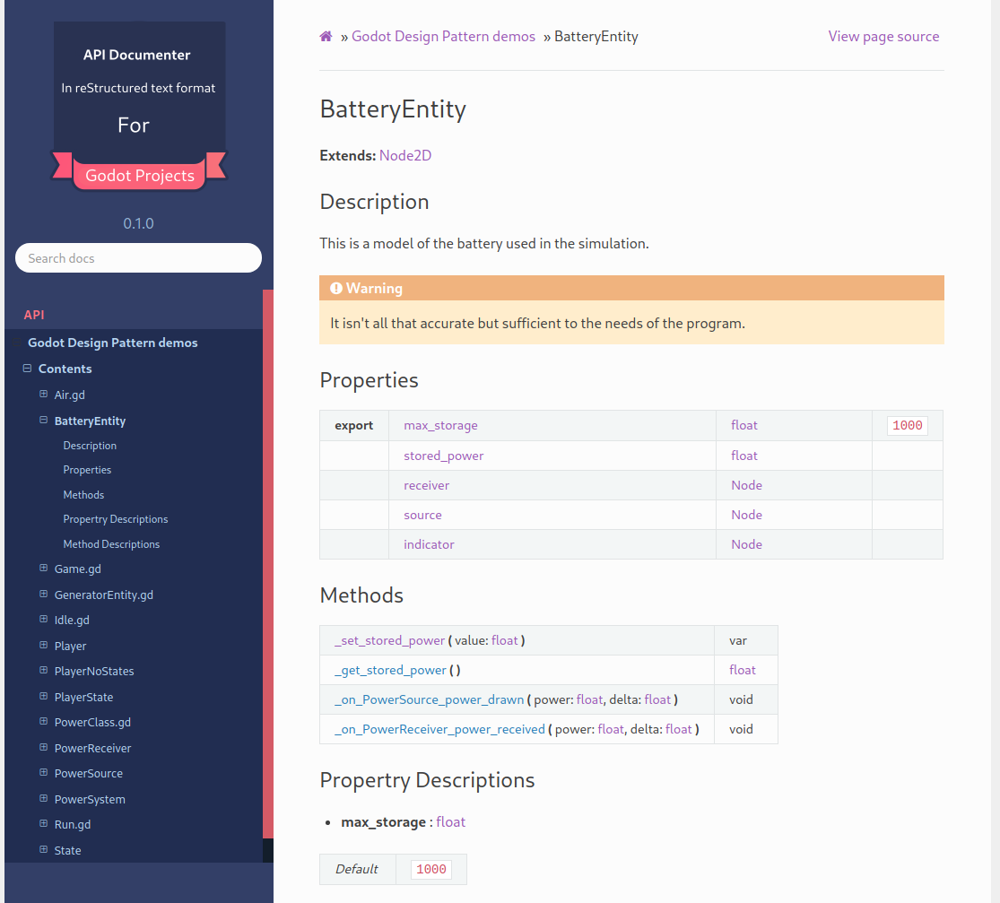
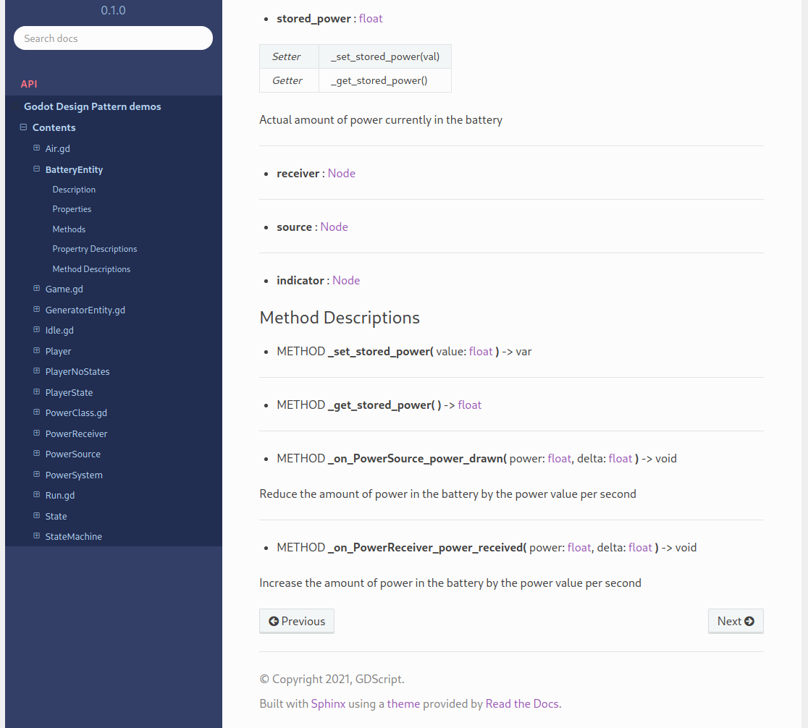

.. This page shows the user what the application produces

Overview
========

In any large project keeping track of the code can be a problem and one of the main tools
to help in this is a well documented list of the classes and functions created in the project.

The gdscript2rest application is designed to take code comments such as in the following sample
taken from `GDQuest/godot-design-patterns <https://github.com/GDQuest/godot-design-patterns>`_:

.. code-block:: gdscript

    # The model of the battery used in the
    # simulation.
    #
    # .. warning:: This mode isn't at all accurate
    #  and should not be used for any practicle
    #  projects.

    class_name BatteryEntity
    extends Node2D

    ## Total amount of power the battery is able to hold
    export var max_storage := 1000.0

    ## Actual amount of power currently in the battery
    var stored_power := 0.0 setget _set_stored_power

    onready var receiver := $PowerReceiver
    onready var source := $PowerSource
    onready var indicator := $Indicator

    func _set_stored_power(value: float) -> void:
        stored_power = value

        # Make sure all nodes are ready
        if not is_inside_tree():
            yield(self, "ready")

        # Set receiver efficiency to 0 if already full, otherwise set it to a percentage
        # of power that it can still receive from its input capacity.
        receiver.efficiency = (
            0.0
            if stored_power >= max_storage
            else min((max_storage - stored_power) / receiver.power_required, 1.0)
        )

        # Set efficiency to 0 if battery is empty, otherwise set it to a percentage
        # that it can provide from its amount and output capacity, up to 100%
        source.efficiency = (0.0 if stored_power <= 0 else min(stored_power / source.power_amount, 1.0))

        # Update shader with power amount so the indicator is up to date with amount
        indicator.material.set_shader_param("amount", stored_power / max_storage)

    ## Reduce the amount of power in the battery by the power value per second
    func _on_PowerSource_power_drawn(power: float, delta: float) -> void:
        self.stored_power = max(
            0, stored_power - min(power, source.power_amount * source.efficiency) * delta
        )

    ## Increase the amount of power in the battery by the power value per second
    func _on_PowerReceiver_power_received(power: float, delta: float) -> void:
        self.stored_power = min(max_storage, stored_power + power * delta)

and produce reStructuredText (.rst) files for incorporating into a Sphinx document as shown below.

