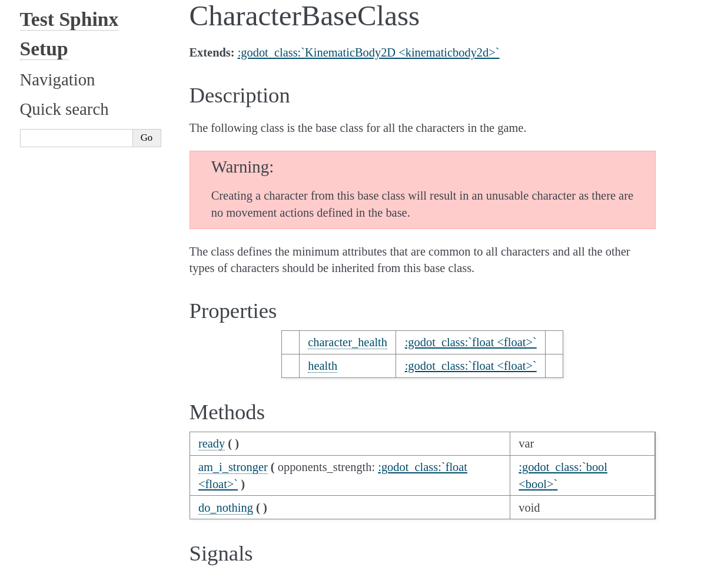

Configuring Sphinx
==================

If you have set up Sphinx by doing ``(.venv) $ sphinx-quickstart`` then you will have a conf.py 
file that looks something like this:

.. code:: console

    # Configuration file for the Sphinx documentation builder.
    #
    # For the full list of built-in configuration values, see the documentation:
    # https://www.sphinx-doc.org/en/master/usage/configuration.html

    # -- Project information -----------------------------------------------------
    # https://www.sphinx-doc.org/en/master/usage/configuration.html#project-information

    project = 'Godot API documentation'
    copyright = '2022, Doc Creator'
    author = 'Doc Creator'
    release = '0.0.1'

    # -- General configuration ---------------------------------------------------
    # https://www.sphinx-doc.org/en/master/usage/configuration.html#general-configuration

    extensions = []

    templates_path = ['_templates']
    exclude_patterns = ['_build', 'Thumbs.db', '.DS_Store']

    # -- Options for HTML output -------------------------------------------------
    # https://www.sphinx-doc.org/en/master/usage/configuration.html#options-for-html-output

    html_theme = 'alabaster'
    html_static_path = ['_static']

If you view an API.rst file with these settings the output will look something like:

Which is not the look we are aiming for.  Also, as it stands at the moment none of the links to the Godot
documentation work.

In order to get the look and feel of the Godot documentation we need to do three things:

* Set up the ``conf.py`` file
* Create a ``custom.css``
* Add extensions to enable Sphinx to recognise GDScript files.

.. toctree:: 

    setup_conf_py
