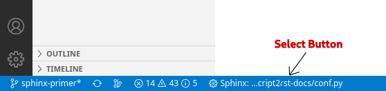
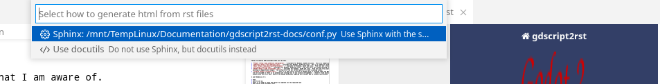

   | **The time has come,' the Walrus said,**
   |     **To talk of many things:**
   | **Of shoes — and ships — and sealing-wax —**
   |    **Of cabbages — and kings** — *and IDEs*

Choosing an IDE
===============

In order to make the creation of the documents easier a good editing system is a must.  The editing system should be
able to to handle two things with ease.

* Edit .rst files with live updates
* Run the Sphinx build system from within the editor.

There are several IDEs available that will do this.

* `PYCharm <https://www.jetbrains.com/pycharm/>`_ - available for Windows, macOS and Linux.  This is a commercial product.
* `JetBrains <https://www.jetbrains.com/>`_ - available for Windows, macOS and Linux.  This is a commercial product.
* `Emacs <https://www.gnu.org/software/emacs/>`_ - available for Windows, maxOS and Linux.  Free tool but a very steep learning curve and needs extensive Setup.
* `Vim <https://www.vim.org>`_ - available for Windows, maxOS and Linux.  Free tool but a very steep learning curve and needs extensive Setup.
* `VSCode <https://code.visualstudio.com/>`_ - available for Windows, maxOS and Linux.  Free tool and very popular.  Setting up for reStructuredText
  editing is comparatively simple.  The software is free but certain parts of it have licensing issues.
* `vscodium <https://vscodium.com/>`_ - This is an open source version of VSCode which is released under the MIT licence.  Certain parts of VSCode
  are not included so there is no problem with running foul of any licence infringement.  I haven't tried building a Sphinx
  project with this so I don't know if the VSCode extensions required will install due to license restrictions.

I use VSCode as it is:

* Free (at least for documentation creation).
* Easy to set up
* There is no need to leave the editor to complete all the required task
* The preview works extremely well.  

There are probably other IDEs/editors that will do the job adequately, 
these are just the ones that I am aware of.

Setting Up VSCode
-----------------

Install VSCode
^^^^^^^^^^^^^^

The first thing to do is install VSCode.  Installation is straightforward and can be found at the
`VSCode Download <https://code.visualstudio.com/Download>`_ page.

Install Extensions
^^^^^^^^^^^^^^^^^^

Two VSCode extensions and a python module are required to enable VSCode to fully work with reStructuredText files:

1. The `reStructuredText <https://marketplace.visualstudio.com/items?itemName=lextudio.restructuredtext>`_
   extension by LeXtudio - this is the basic extension for working with reStructuredText text files.  It gives:

   * Code Snippets
   * Live Preview 
   * Editor Enhancements
   * Linter
   * IntelliSense

2. The `reStructuredText Syntax highlighting <https://marketplace.visualstudio.com/items?itemName=trond-snekvik.simple-rst>`_
   extension by Trond Snekvik - this extension is recommended by the reStructuredText test extension.

Both of the above can be installed by going to the extensions tab in VSCode and searching for them by name 
or by following the above links to the marketplace.

.. note::
   The reStructuredText extension also recommends that the VSCode python extension should be installed. 
   I have the python extension installed as a matter of course so don't know what difference it makes 
   if it isn't installed.  If you find the extension behaving strangely I would suggest 
   installing the Python extension as this may be the problem.

3. The `Esbonio <https://pypi.org/project/esbonio/>`_ python module - this is a language server designed to work with 
   reStructuredText and Sphinx.

   It can be installed by

   .. code:: console

      (.venv) ...$ pip install esbonio

  .. attention:: 

    If you are using virtual environments the esbonio extension need installing for each new project.

No preview showing
==================

The reStructuredText extension can use 2 methods for rendering the preview: Sphinx and docutils.  The docutils does
not understand a large proportion of the Sphinx syntax so, unless your .rst file is very simple it won't be rendered.

For this reason the setting ``restructuredtext.preview.name`` should be set to Sphinx.

If you are editing a reStructuredText document then there is also a button on the bottom bar that allows you to choose
the correct preview renderer.

which will bring up the following for you to choose the restructuredtext renderer

